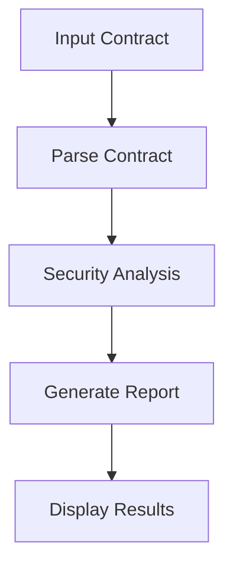

# 🔮 Blockchain-analyzer

An AI-powered smart contract analyzer using LangGraph for orchestrated analysis workflows and GPT-4 for deep contract understanding.

## 🌟 Architecture Overview

### LangGraph Implementation
The project uses LangGraph to create a structured analysis workflow:

1. **Contract Parsing Node**
   - Breaks down smart contracts into logical sections
   - Identifies contract type (ERC20, ERC721, etc.)
   - Maps main functions and their purposes
   - Analyzes state variables and their roles

2. **Security Analysis Node**
   - Performs deep security analysis
   - Identifies potential vulnerabilities
   - Checks for best practice violations
   - Suggests gas optimizations

### Analysis Workflow


## 🛠️ Tech Stack

- **Core Analysis**:
  - LangGraph for workflow orchestration
  - GPT-4 for contract analysis
  - OpenAI API for AI interactions

- **Frontend**:
  - Next.js 14 with App Router
  - TypeScript for type safety
  - Tailwind CSS with Web3 theme
  - Glass morphism UI effects

## 🚀 Getting Started

1. **Clone and Install**
```bash
git clone https://github.com/yourusername/blockchain-analyzer.git
cd blockchain-analyzer
npm install
```

2. **Environment Setup**
Create a `.env.local` file:
```env
OPENAI_API_KEY=your_openai_api_key
```

3. **Run Development Server**
```bash
npm run dev
```

## 💡 Features

### Smart Contract Analysis
- **Automated Parsing**: LangGraph breaks down contracts into logical sections
- **Security Analysis**: Identifies vulnerabilities and risks
- **Gas Optimization**: Suggests improvements for gas efficiency
- **Best Practices**: Checks against smart contract development standards

### Analysis Process
1. **Contract Input**
   - Paste contract source code
   - Clean code formatting
   - Initial validation

2. **LangGraph Analysis**
   ```typescript
   const graph = new StateGraph<ContractState>({
     channels: ["contract_parsed", "analysis_complete"],
   });

   // Parsing node
   graph.addNode("parse_contract", {
     work: RunnableSequence.from([
       parsingPrompt,
       model,
       async (output) => ({
         parsed_sections: JSON.parse(output.content),
       }),
     ]),
   });

   // Analysis node
   graph.addNode("analyze_contract", {
     work: RunnableSequence.from([
       analysisPrompt,
       model,
       async (output) => ({
         results: JSON.parse(output.content),
       }),
     ]),
   });
   ```

3. **Results Generation**
   - Security score calculation
   - Detailed findings report
   - Actionable recommendations

## 📊 Analysis Output

```typescript
interface AnalyzeResponse {
  contract_type: string;
  security_score: number;
  findings: Array<{
    category: string;
    severity: 'low' | 'medium' | 'high';
    description: string;
  }>;
  recommendations: string[];
}
```

## 🔒 Security Considerations

- All analysis performed locally
- No contract storage
- Secure API key handling
- Rate limiting on API endpoints

## 🎯 Future Enhancements

- [ ] Support for multiple contract files
- [ ] Custom analysis rules engine
- [ ] Integration with popular blockchain explorers
- [ ] Automated audit report generation
- [ ] Real-time vulnerability monitoring

## 📜 License

MIT License - see LICENSE for details

## 🤝 Contributing

Contributions welcome! Please read our contributing guidelines before submitting PRs.

## 🏗️ Project Structure

```
blockchain-analyzer/
├── src/
│   ├── app/
│   │   ├── api/
│   │   │   └── analyze/
│   │   ├── globals.css
│   │   └── page.tsx
│   ├── components/
│   │   ├── layout/
│   │   └── ui/
│   ├── lib/
│   │   ├── graph/
│   │   │   ├── contractGraph.ts
│   │   │   └── types.ts
│   │   └── utils/
│   └── styles/
```
